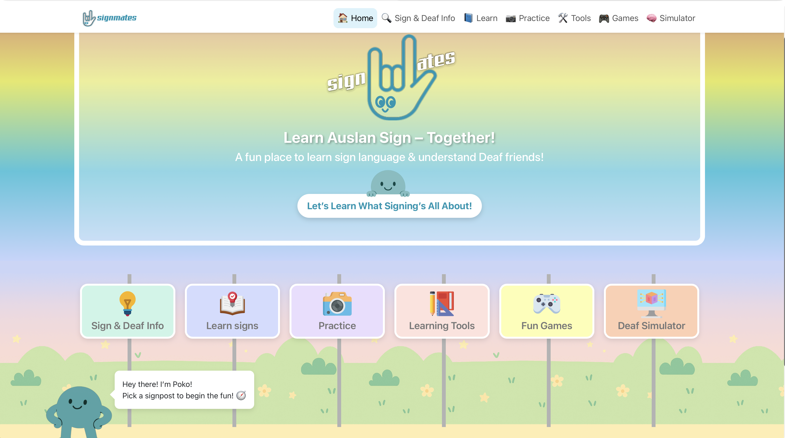
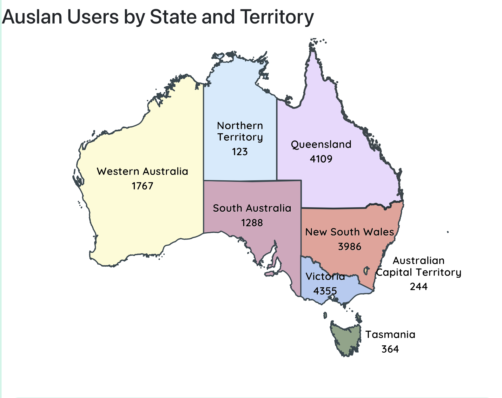

# Visualisations — SignMates Auslan Insights

This page presents the visual content used in the SignMates project, demonstrating both UI/UX structuring and data-driven educational insights.

---

## SignMates Homepage  

A welcoming, child-friendly interface designed to encourage exploration through:
- practice modules  
- sign learning  
- Deaf awareness tools  
- mini-games  
- learning tools  

---

## Auslan Users by State & Territory  

This choropleth-style map shows the distribution of Auslan speakers across Australian states and territories.

Dataset source: ABS Cultural Diversity (Table 5 — Auslan row).  
Used for demographic profiling and accessibility planning.

---

